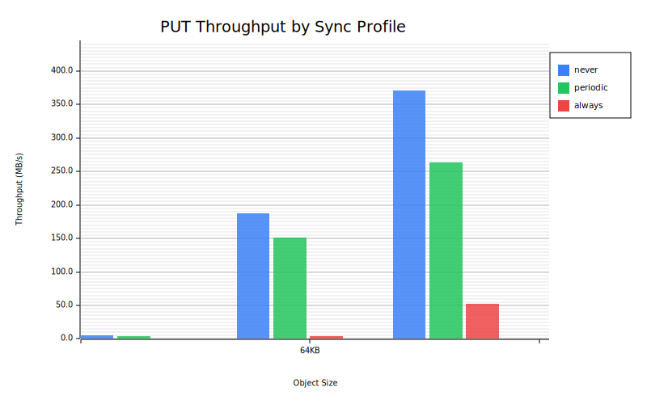
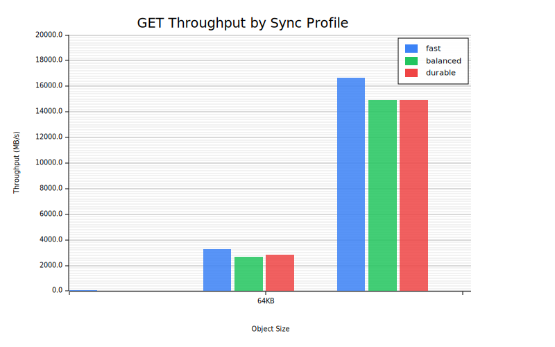
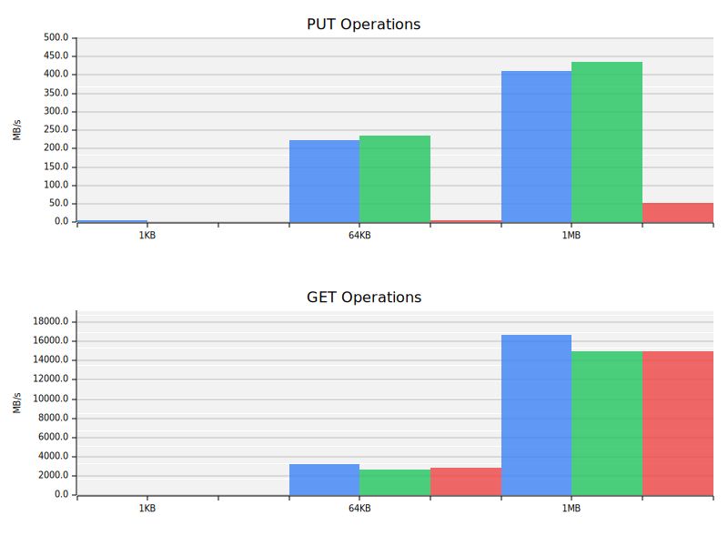

# Rucket Benchmark Results

Performance benchmarks comparing different sync profiles across object sizes.

## Sync Profiles

| Profile | Data Sync | Metadata Sync | Use Case |
|---------|-----------|---------------|----------|
| **Fast** | None | Periodic | Development, testing, max speed |
| **Balanced** | Periodic | Always | Production default |
| **Durable** | Always | Always | Critical data, max durability |

### Profile Details

- **Fast**: No fsync on data files, periodic metadata commits. Best throughput but data may be lost on crash.
- **Balanced**: Periodic fsync on data files, immediate metadata durability. Good balance for production.
- **Durable**: Immediate fsync on all writes. Maximum durability, lower throughput.

## PUT Throughput



PUT operations write new objects to storage. Performance varies significantly by sync profile:
- Fast profile shows maximum write throughput
- Durable profile shows the cost of full durability

## GET Throughput



GET operations read objects from storage. Performance is relatively consistent across profiles since reads don't require fsync operations.

## Combined Comparison



Side-by-side comparison of all profiles for both PUT and GET operations.

## Running Benchmarks

Generate fresh benchmark results:

```bash
# Run all benchmarks and generate graphs
./scripts/run-benchmarks.sh

# Or run manually:
cargo bench --bench throughput
cargo run --features bench-graph --bin bench-graph --release
```

## Benchmark Environment

### Hardware

| Component | Specification |
|-----------|---------------|
| **CPU** | Intel Core i7-10510U @ 1.80GHz (4 cores) |
| **Memory** | 32 GB DDR4 |
| **Storage** | 98 GB LVM volume |
| **OS** | Ubuntu 24.04.3 LTS |
| **Kernel** | 6.8.0-90-generic |

### Methodology

Benchmarks are run using [Criterion.rs](https://github.com/bheisler/criterion.rs):

- **Warm-up**: 3 seconds per benchmark
- **Measurement**: 5 seconds per benchmark
- **Iterations**: Automatically determined by Criterion
- **Storage**: In-memory metadata store with filesystem data
- **Isolation**: All background services stopped during benchmarks

## Results Data

Raw benchmark data is exported to `results/latest.json` for programmatic access and historical comparison.

## Object Sizes

Three representative object sizes are tested:

| Size | Use Case |
|------|----------|
| 1KB | Small objects, metadata-heavy workloads |
| 64KB | Medium objects, typical API payloads |
| 1MB | Large objects, file storage |
